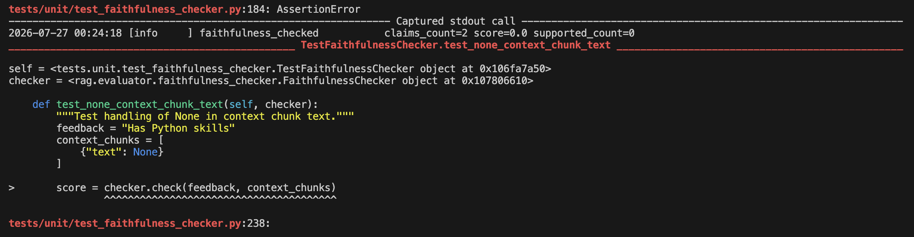
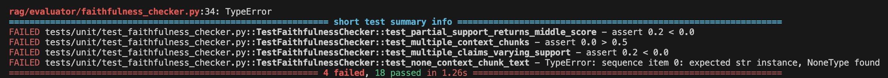

## Week 7 — Issue selection

**Issue link:** [https://github.com/ascherj/pathreview/issues/153]

**Issue title:** [Faithfulness checker crashes when a context chunk has text: None]

**Tier:** [x] Tier 1  [ ] Tier 2  [ ] Tier 3

**Problem summary:**
[test_faithfulness_checker.py's 4 tests failed, and 18 passed. The exact issue is caused at test_none_context_chunk_text - TypeError: sequence item 0: expected str instance, NoneType found. I will need to figure out a way to return a string. A successful issue fix will mean a string gets returned instead of a NoneType. Based on the checklist, I have an overall understanding of the issue. It is not my first open source contribution, however I chose Tier 1. I found the relevant code and the relevant test file. I've checked the issue comments and the ledger's Claims count, and I'm fine with how many others are on this issue.]

**Branch name:** [fix/150-faithfulness_checker]

**Setup confirmation:** [x] App runs locally at localhost:5173

**Cohort ledger:** [x] Issue added to cohort ledger

**Selection notes:** 
[I felt this issue will help me further get comfortable with RAG.]

## Week 8 — Reproduction & solution planning

**Reproduction commit link:** 

**Reproduction summary:**
[I reproduced the issue by running tests/unit/test_faithfulness_checker.py. A string is expected to be returned back by the function, but NoneType is being returned.]

**PLAN.md link:** [https://github.com/Sangeetha-007/pathreview/blob/fix/150-faithfulness_checker/PLAN.md]

**Walkthrough video (recommended):** [link to your Loom video, ≤2 min — recommended, not graded]

**Blockers or open questions:**
[Anything you're still uncertain about going into Week 9, or leave blank]

## Week 9 — Solution building & PR submission

### Check-in 1 (mid-week)

**Current progress:**
I implemented test_check_raises_when_chunk_text_is_none() inside of test_faithfulness_checker.py. 

**Next steps:**
The next steps are to complete the following steps in PLAN.md which is to fix check(). 

**Blockers:**
[Anything slowing you down? Or leave blank.]

---

### Check-in 2 (end of week)

**PR link:** [link to your submitted pull request]

**Branch:** [the branch name you worked on, e.g. `fix/123-short-description`]

**What you built:**
[1–3 sentences summarizing what your fix does and how it works]

**Tests added or updated:**
[Which test files did you touch? What do they cover?]

**Self-review confirmation:** [ ] make check passes  [ ] make test-unit passes

**Draft PR feedback received from:** [name or Slack handle, or "none"]

